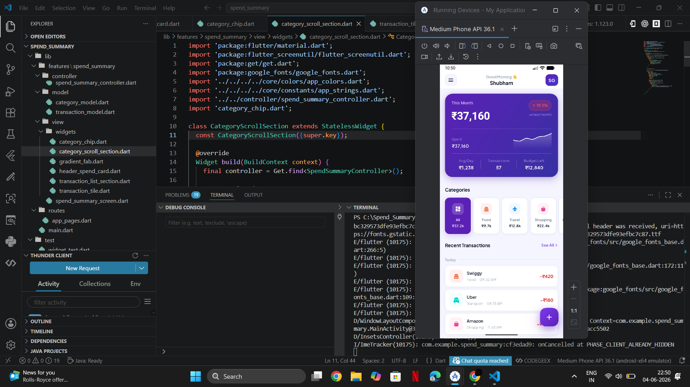

## Spend Summary App

A Flutter Spend Summary screen built with mock data.

## Screenshots

## AI Tools Used

I used Claude as an AI assistant during this assignment.

I have been using Claude for a long time, so I am comfortable with its workflow, response style, and code suggestions. I chose Claude because it helps me quickly understand requirements, break tasks into smaller steps, and generate clean Flutter UI code faster.

For this project, I first reviewed the assignment requirements and planned the project structure based on the required Spend Summary features. Claude was then used to generate the initial Flutter widget code, mock data, and UI layout ideas based on that plan.

After the code generation, I manually reviewed the code, customized the UI, adjusted spacing, colors, interactions, and tested the app on an emulator.

AI was used mainly for:
- Requirement breakdown and implementation guidance
- Faster Flutter widget code generation
- Mock data and UI layout suggestions
- Quick iteration during development

The final implementation decisions, UI customization, and testing were done manually by me.
